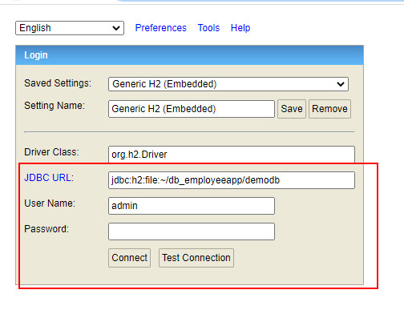

# Employee Management App (Back End)

## Dependencies

1. H2 Database
2. Spring JDBC Template
3. Junit
4. AssertJ

## Assumptions

1. If there are two records with the same login, the 2nd record is dropped

## Important to note

1. This project has been only tested on a Windows machine 
2. Unit tests can be found in `src/test/java/com/cognizant/backend/employeeapp`
3. Any record sent to the back end is saved locally. The database folder is automatically created in `C:\Users\youruser\db_employeeapp` where `youruser` is name of the currently logged in user.
4. To access the database directly you can visit `http://localhost:8080/h2-console/`. However, the project has to be running. Enter the connection parameters highlighted by the red box shown in the screenshot below. The password is `password`.

## How to use 

1. Navigate to releases in this repository and download the jar file
2. Save the file to your desired folder
3. Open command prompt and navigate to the folder containing the jar file
4. Run the command `java -jar nameofjarfile.jar`
5. Alternatively, you can just download the project, unzip it, import it to eclipse or any ide before running the application.